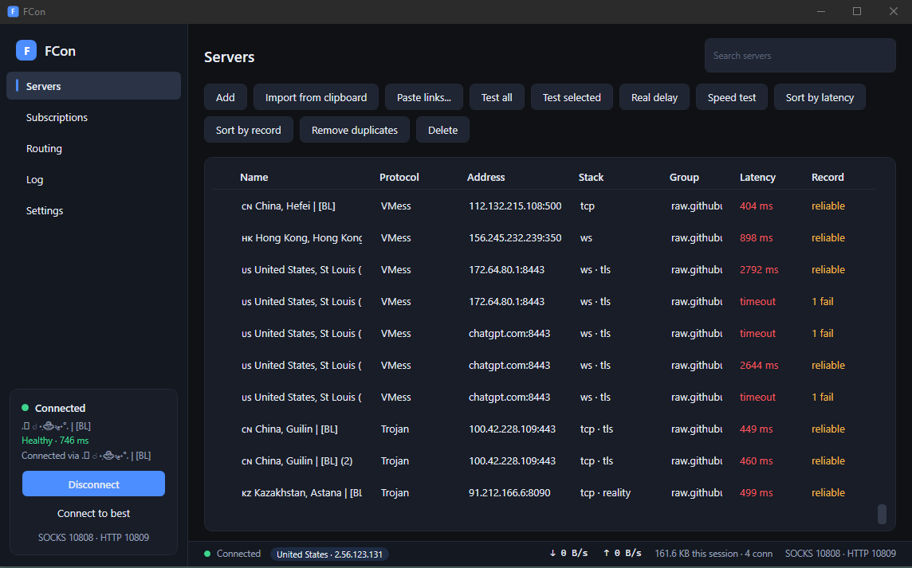
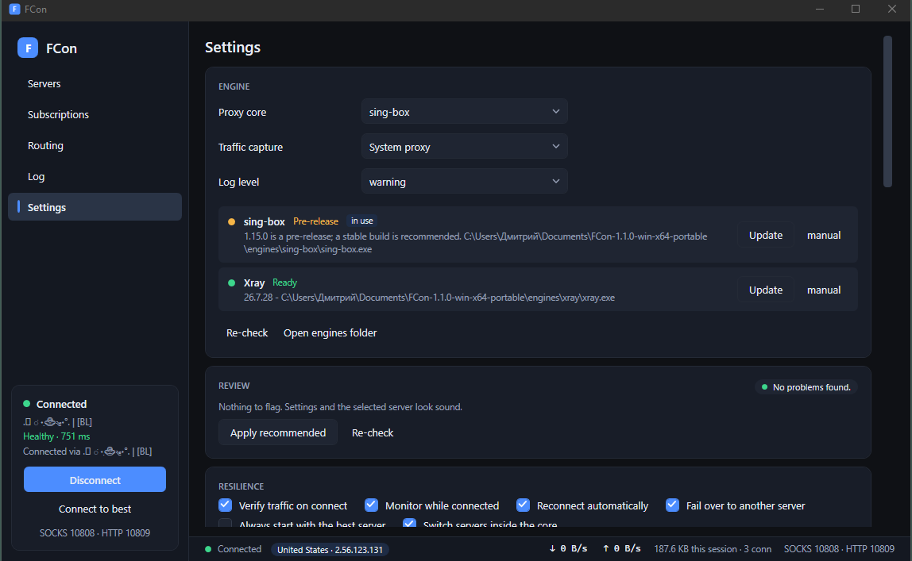
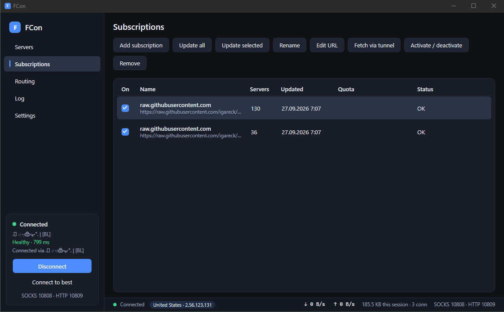

# KVN

A Windows VPN client that stays connected.

Paste a link or a subscription, press Connect, and forget about it. KVN watches the
tunnel and swaps a failing server for a working one inside the running core, in about a
second, without dropping what you were doing.



## Why KVN

- **Every protocol your provider hands out.** VLESS (XTLS Vision, REALITY), VMess,
  Trojan, Shadowsocks (2022, SIP003), SOCKS5, HTTP, WireGuard, Hysteria 2, TUIC, AnyTLS,
  ShadowTLS. All transports, TLS with browser fingerprints.
- **Stays up.** Your good servers sit in the core as a group. A dead one is swapped in
  about a second; nothing restarts, downloads and calls survive. If the whole group is
  gone, KVN fails over, backs off and keeps trying until you say stop.
- **Honest numbers.** "Connected" means a real request went through. *Test all*
  measures servers by real requests, not pings. The status bar shows the exit country,
  live speed and the server you are actually on.
- **Two cores, your choice.** sing-box (default, with TUN mode) or Xray. One click
  downloads the latest stable release and verifies its checksum.
- **Routing you control.** Rules by domain, IP, process and port. Keep LAN and Windows
  traffic direct, block ads and QUIC.
- **Nothing left behind.** The system proxy is restored even after a crash. The portable
  build keeps everything in one folder.
- **English and Russian.** Follows Windows, or pick one in Settings; switches live.

<p align="center">
  
  
</p>

## Get it

1. Unzip `KVN-<version>-win-x64-portable.zip` (needs nothing installed) or
   `KVN-<version>-win-x64.zip` (needs the .NET Desktop Runtime 10) and run `KVN.exe`.
2. Settings → **Download** next to sing-box or Xray. Or fetch a core yourself and drop
   the executable into `engines\sing-box\` or `engines\xray\` beside `KVN.exe`:
   - sing-box: [latest release](https://github.com/SagerNet/sing-box/releases/latest),
     file `sing-box-<version>-windows-amd64.zip` (sing-box 1.12 or newer)
   - Xray: [Xray-windows-64.zip](https://github.com/XTLS/Xray-core/releases/latest/download/Xray-windows-64.zip)
     from the [latest release](https://github.com/XTLS/Xray-core/releases/latest)
3. Servers → **Connect**. Two curated public lists for Russia ship built in and are
   fetched on first start. To add your own, copy a share link or a subscription address
   and press **Ctrl+V** anywhere in the window.

TUN mode needs sing-box and administrator rights.

## For developers

Requires the .NET SDK 10.

```
dotnet build FCon.slnx
dotnet test tests/FCon.Core.Tests                            # unit tests, no cores needed
dotnet run --project tools/FCon.Smoke                        # generates configs and runs them on the real cores
powershell -ExecutionPolicy Bypass -File build/publish.ps1   # both zips into dist/
```

Put `sing-box.exe` in `engines/sing-box/` and `xray.exe` in `engines/xray/`, or set
`FCON_ENGINES_DIR`, so the smoke tool can verify against real cores. Download links are
in *Get it* above. Cores are never packaged; sing-box must be 1.12 or newer.

Layout: `FCon.Abstractions` (plugin contract), `FCon.Plugins.Builtin` (the ten
protocols), `FCon.Core` (config generation, supervision, storage), `FCon.App` (WPF),
`tests/`, `tools/FCon.Smoke`.

Protocols are plugins. Implement `IProtocolPlugin` against `FCon.Abstractions`, mark the
assembly with `[assembly: FConPluginAssembly("Name", "1.0.0")]`, and drop the DLL in
`plugins/<name>/` beside the executable. The editor renders your fields from the
descriptor. Current contract version: 3.
